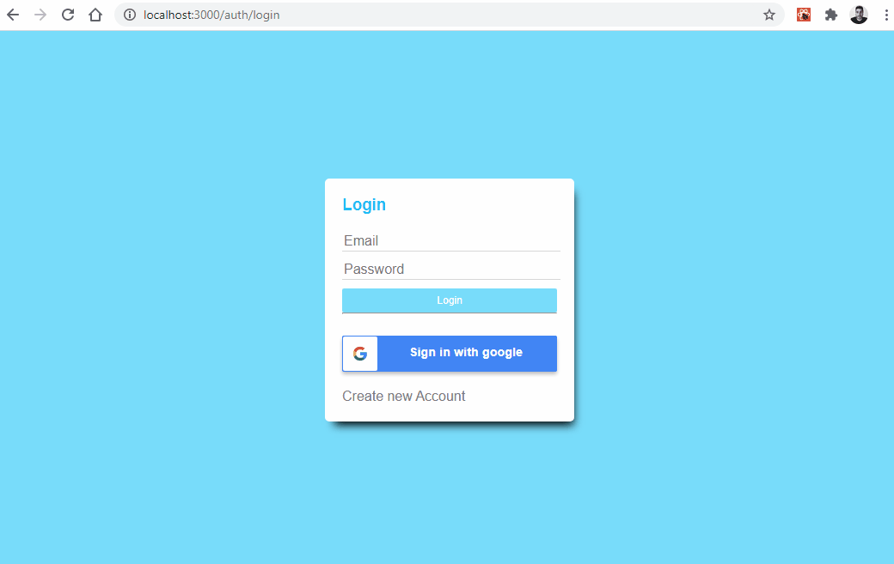

# JournalApp
Para agregar notas diarias

## App realizada en React , Redux y Firebase/Firestore.

Además contiene..:

- Sass para dar estilos y Font-Awesome para iconos.
- Creación de usuarios con email y password en Firebase.
- React Router para manejo de rutas utilizando varios router.
- Protección de Rutas si no estas logueado.
- Login con Google.
- Manejo de errores en formularios.
- Redux para manejar los estados globales y Thunk Middleware acciones asíncronas.
- CRUD en Firestore.
- Upload de imagenes a Cloudinary.
- Manejo de fechas con MomentJS.
- Animaciones con Animate.css .

